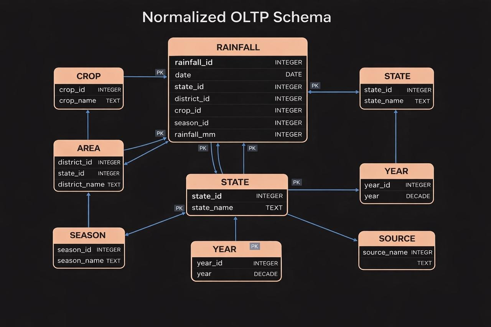
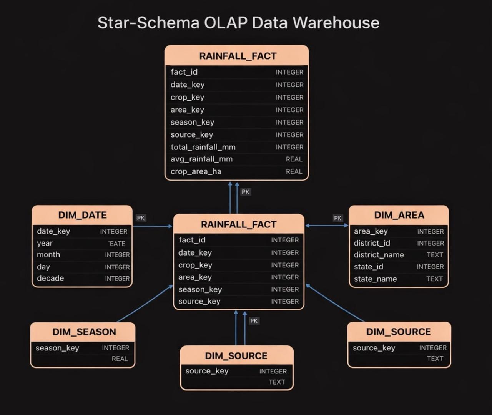

# India Crop & Rainfall Data Warehouse Project

This project analyzes crop production trends across Indian states by integrating
crop statistics and rainfall data using a data warehouse approach.

## Objectives
- Build a clean ETL pipeline
- Design a star-schema data warehouse
- Analyze crop yield vs rainfall trends
- Enable state-wise and crop-wise analytics

## Tech Stack
- Python (Pandas, NumPy)
- SQL
- Jupyter Notebook
- Excel / CSV
- Data Warehouse Modeling

## Data Sources
- Government of India Crop Statistics
- IMD Rainfall Data

## Project Structure

### ER Diagram

## Author

Sanjay B
